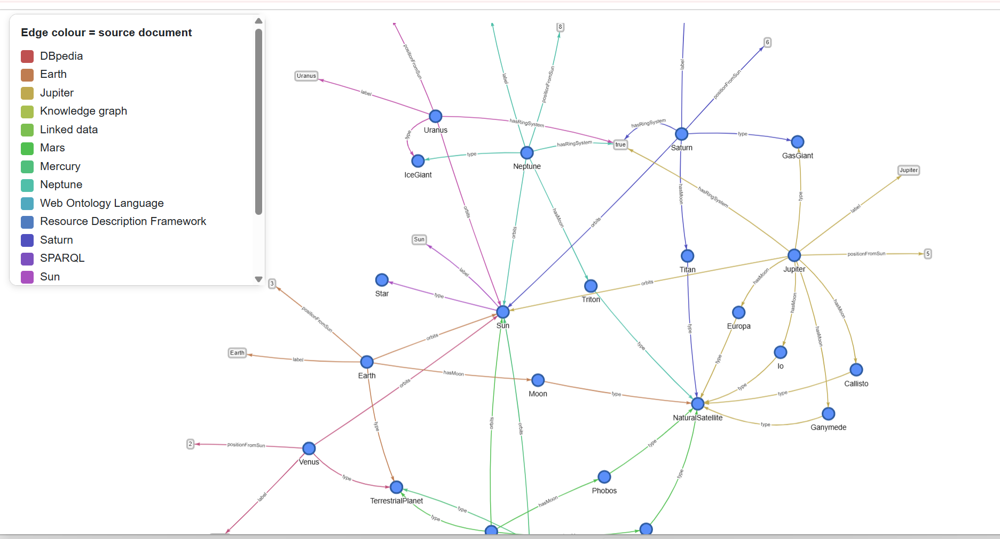
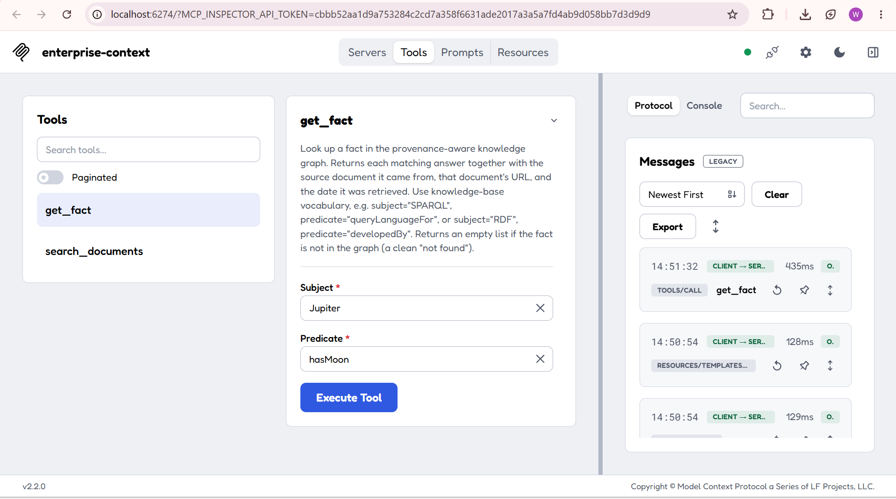
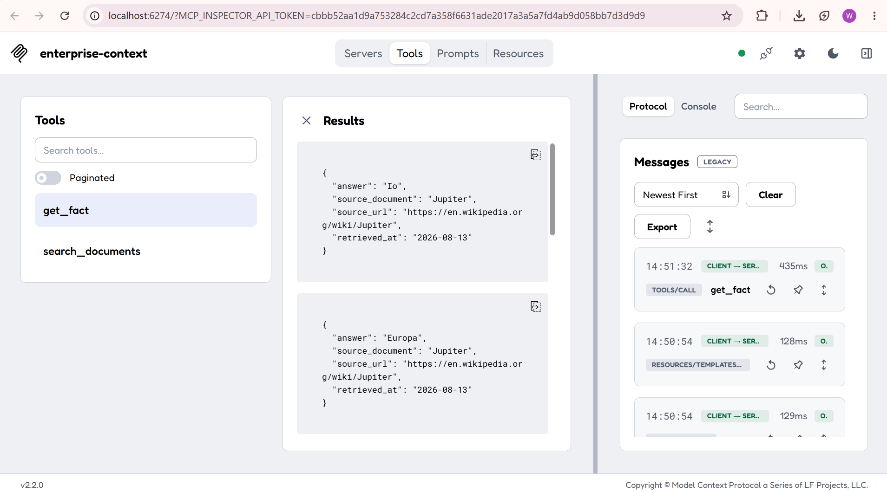

# Provenance-aware retrieval for enterprise AI agents

A small, self-contained study comparing two ways of giving an AI agent access to
enterprise knowledge, and showing how they behave as the knowledge base grows.

> **Scope, stated honestly:** this is a self-directed proof of concept built to
> understand a trade-off, not a benchmark or a finished research system. See
> *Limitations* below.

## The question

When an agent retrieves knowledge to answer a question, does a **provenance-aware
knowledge graph** give more *traceable, auditable* answers than **plain vector
retrieval**, and how does that hold up as the knowledge base scales?

Two retrieval methods run over the same corpus:

1. **Knowledge graph (RDF + SPARQL)** where every fact carries provenance
   (source document, retrieval date, license).
2. **Vector retrieval (TF-IDF)** over the same documents.

The knowledge base spans **two domains that grew additively**: semantic-web
standards (RDF, SPARQL, OWL, knowledge graphs, linked data, DBpedia) and the
Solar System (the Sun and eight planets, with moons and orbits). Every fact is
derived from a cited Wikipedia article (`data/LICENSE-DATA.md`). There is **no
LLM** in the pipeline; both methods are deterministic and run locally with no
API keys.

The same graph is also exposed to AI agents over **MCP** and can be explored as
an **interactive, provenance-coloured graph**.

## Findings

Evaluated on 15 questions across both domains (12 answerable, 3 unanswerable):

| Metric | Knowledge graph | Vector (TF-IDF) |
|---|:--:|:--:|
| Answer correct | 15/15 | 11/15 |
| Correct source cited | 12/12 | 8/12 |
| Abstained on unanswerable | 3/3 | 2/3 |

The graph returns a **typed, exact answer** with the **exact source document, its
URL, and retrieval date**. Vector retrieval returns a **passage** that must still
be read to extract the answer, and it showed two weaknesses that **got worse as
the knowledge base grew**:

- **Vocabulary collisions at scale.** Once a second domain was added, common
  words ("moon", "Sun", "planet") appear across many documents, so TF-IDF ranks
  the wrong source first, and it misses on simple form mismatches (query "moon"
  vs text "moons"), because it matches words, not meaning.
- **Weaker abstention.** For a question whose topic *is* in the corpus but whose
  answer is not ("How many people live on Mars?"), the vector method fails to
  abstain, while the graph cleanly returns nothing.

So the graph's advantage is in **precision and traceability**, and it **widens as
the knowledge base scales**, which is the property that matters for a governed
enterprise knowledge base.

## How it fits together

One provenance-aware core, with several faces:

- **Core:** the corpus, curated facts, and `src/build_graph.py`, which builds an
  RDF dataset where each document's facts live in a named graph tied to its
  provenance.
- **Research face:** `src/evaluate.py` compares graph vs vector and writes the
  results.
- **Human face:** `src/visualize.py` renders the graph as an interactive network,
  coloured by source, hover any edge for its provenance.
- **Agent face:** `src/mcp_server.py` serves the knowledge to agents over MCP, so
  an agent gets answers with provenance attached.

## Screenshots

**Interactive knowledge graph** (edges coloured by source document; hover for
provenance):



**Live MCP call** in the MCP Inspector: an agent-style client calls `get_fact`
and receives a sourced, machine-readable answer:




## Running it

Tested on Windows 10/11 with Python 3.10. From the project folder:

```bash
# 1. install dependencies
pip install -r requirements.txt

# 2. grow the knowledge base with the solar-system domain (run once)
python scripts/add_solar_system.py

# 3. build the graph and run a traceable SPARQL query
python src/build_graph.py

# 4. run the vector-retrieval demo
python src/build_vectors.py

# 5. compare both methods across all questions -> writes results/
python src/evaluate.py

# 6. build the interactive graph -> open results/graph.html in a browser
python src/visualize.py
```

### Serving it to an agent over MCP

```bash
# start the MCP server (Ctrl+C to stop); it waits for a client to connect
python src/mcp_server.py
```

To watch a client call it live in the **MCP Inspector** (needs Node.js):

```powershell
# one-time: allow local scripts for your user (Windows PowerShell)
Set-ExecutionPolicy -Scope CurrentUser -ExecutionPolicy RemoteSigned

# launch the Inspector pointed at the server with plain python
npx.cmd @modelcontextprotocol/inspector python src/mcp_server.py
```

Open the `http://localhost:6274?...` link it prints, connect, open **Tools**, and
call `get_fact` (e.g. subject `Jupiter`, predicate `hasMoon`) or `search_documents`.

**Windows notes (things that tripped me up):**
- After installing Node.js, open a **new** terminal so `node`/`npx` are on PATH.
- If `npx` reports *"running scripts is disabled"*, run the `Set-ExecutionPolicy`
  line above, or call `npx.cmd` instead of `npx`.
- If the Inspector's auto-command fails with *"'uv' is not recognized"*, use the
  explicit `npx.cmd @modelcontextprotocol/inspector python src/mcp_server.py`
  form above (it uses plain `python`).

## Layout

```
data/       corpus documents + provenance.json + data license
facts/      curated triples (facts.json) + evaluation questions (questions.json)
scripts/    add_solar_system.py (additive domain growth)
src/        build_graph.py, build_vectors.py, evaluate.py, visualize.py, mcp_server.py
docs/       images used in this README
results/    generated artifacts (graph.trig, comparison.csv, summary.md, graph.html)
```

## Limitations / future work

- TF-IDF is **lexical** (word overlap), not semantic embeddings; embeddings would
  recover some of the vector misses. A sentence-transformer backend is a natural
  next step.
- The corpus is small; results are **illustrative, not benchmarked**.
- The vector "answer found" check is a generous substring proxy, disclosed here.
- The MCP tools were verified live in the Inspector; wiring into a full LLM host
  (e.g. an agent that autonomously decides to call them) is future work.

## Data & license

Facts are concise summaries derived from the cited Wikipedia articles under
CC BY-SA 4.0. See `data/LICENSE-DATA.md` and `data/provenance.json`.
